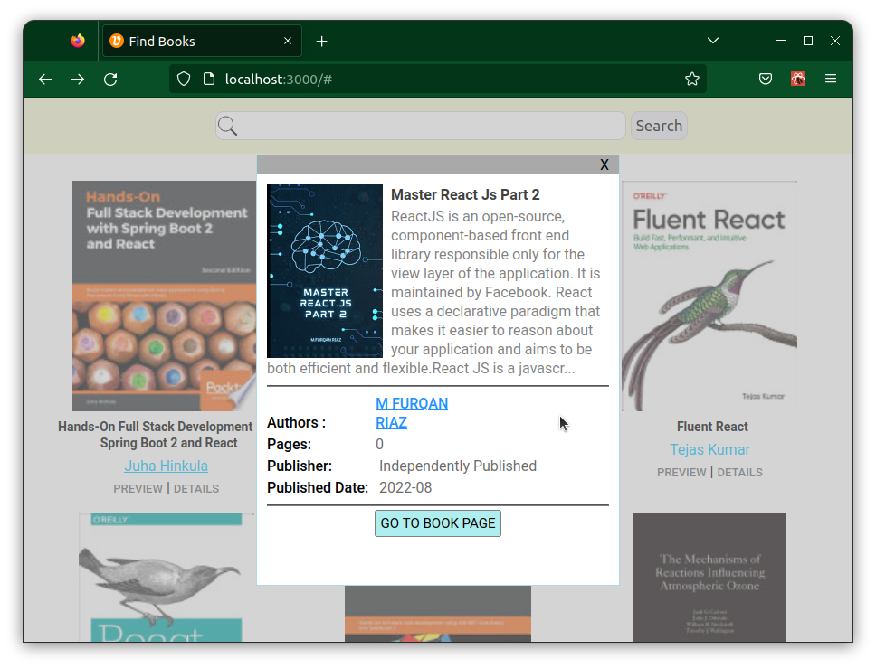

# Kitap Arama Uygulaması

Google Books Api kullanılarak, kitap araması yapılıyor. Sonrasına bulunan kitaplar listeleniyor. Detay bölümünde kitap ile ilgili daha çok bilgi var. Önizleme bölümünde ise google üzerinden ön izleme yapılabiliyor.

## Kullanılan Teknolojiler

Uygulama **React JS** ile geliştirildi. Tasarımda **CSS** kullanıldı. Api işlemleri için **Axios** ve state yönetimi için **React Context Api** kullanıldı.

## Ekran Görüntüleri

Uygulama için alınan ekran görüntüleri.



## Kullanım

Arama işleminin yapılması için kök dizinde **.env** dosyası oluşturularak

```
REACT_APP_SEARCH_API_URL=https://www.googleapis.com/books/v1/volumes?q=
```

kodunun eklenmesi gereklidir. Yada BooksContext üzerinde **searchBooks** ve **getAuthorsBooks** fonksiyonlarında **url** değişkeni bu bilgiye göre düzenlenmelidir.